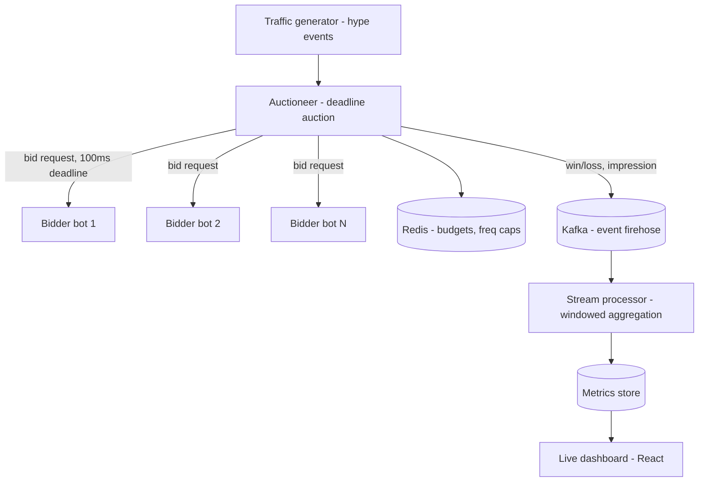

# P3 — HypeExchange: a real-time meme / hype bidding pit

> Recycles your MoneyLion personalization + latency-tuning story into an adtech-native form.

## 1. What it is

HypeExchange is a live exchange where **bots** (and optionally people) bid on trending memes, sounds, or creators in real time — a chaotic trading floor for internet hype. When a new "hype event" fires (a meme starts trending), the exchange runs a **sealed-bid auction** among interested bidders that must resolve within a **hard deadline** (e.g., 100 ms). Late bids are dropped. Winners "own" a slice of that meme's attention; a live dashboard shows what's mooning, win rates, spend, and latency.

Mechanically this is a **real-time bidding (RTB) ad exchange**: a bid request fans out to bidders, each returns a bid before a deadline, you run an auction, and you feed a massive event firehose into windowed analytics. Same engineering as The Trade Desk / AppLovin / an ad SSP — just far more fun to demo.

## 2. What you'll demonstrate

- **Deadline-bounded fan-out/fan-in** — call N bidders, collect responses, hard-cut at the timeout.
- **Auction mechanics** — first-price and second-price (Vickrey) clearing.
- **Budget pacing & frequency capping** with atomic Redis operations.
- **Streaming analytics** — windowed aggregation over an event firehose with **watermarks** for out-of-order/late events.
- **Latency engineering** — your MoneyLion story: parallelizing calls, timeouts, cutting tail latency.

## 3. Tech stack (and why)

- **Java 21 + Spring Boot** (or Go) for the **auctioneer** — you know Spring WebClient/parallel calls + timeouts, which is exactly the pattern here.
- **Apache Kafka** — the event bus for bid requests, impressions, clicks, "invests," conversions.
- **Kafka Streams** (or Flink, or a hand-rolled windowing engine) — windowed aggregation with event-time + watermarks.
- **Redis** — budget counters, frequency caps, and hot leaderboards (atomic `DECRBY`, TTLs).
- **React + a charting lib** (or Grafana) — the live "trending" dashboard.
- **A traffic generator + bidder bots** (Java or Python) — simulate the firehose and the bidders.
- **Docker Compose**, **k6/Gatling** for load.

## 4. Architecture



## 5. Data model / message formats

- **HypeEvent / BidRequest:** `{ id, memeId, category, floorPrice, ts }`.
- **Bid:** `{ requestId, bidderId, price, ts }`.
- **AuctionResult:** `{ requestId, winnerId, clearingPrice, participants, latencyMs }`.
- **Impression/Click/Invest/Conversion:** event-time-stamped records keyed by `requestId`/`memeId`.

Budgets in Redis: `budget:{bidderId}` (integer, decremented atomically on win); frequency cap: `freq:{bidderId}:{memeId}` with a TTL.

## 6. Implementation plan (milestones)

**M1 — Auctioneer core + bidders.** Auctioneer receives a bid request, fans out to N bidder bots **in parallel** (WebClient/CompletableFuture or goroutines), collects bids until a **hard deadline**, and drops stragglers. Clear a **first-price** auction. Bots bid with simple randomized strategies.

**M2 — Second-price + budgets + freq caps.** Add Vickrey (second-price) clearing. Before accepting a win, atomically check+decrement the winner's Redis budget; enforce per-meme frequency caps with TTL keys. Reject bids that would breach budget.

**M3 — Emit the firehose to Kafka.** Every auction emits win/loss + impression events. Add downstream simulated clicks/invests/conversions with realistic delays (so some events arrive late/out of order).

**M4 — Windowed streaming analytics.** Consume the firehose in Kafka Streams: tumbling + sliding windows computing win rate, fill rate, eCPM/clearing price, hype velocity (rate of change of interest), and spend per bidder. Handle **out-of-order events** with event-time + a watermark/grace period; show how late events are folded in.

**M5 — Live dashboard.** React dashboard: top movers, spend by bidder, p99 auction latency, fill rate — updating in near-real-time via WebSocket/SSE.

**M6 — Latency hardening + load test.** Profile the auction path; ensure the deadline is enforced tightly (no slow bidder blocks the auction). Load test to find sustainable auctions/sec and report p99.

## 7. The hard parts, explained

- **Enforcing the deadline without leaking threads:** use a single timeout on the aggregate of parallel calls (e.g., `CompletableFuture.allOf(...).orTimeout(100ms)` or a `select` with a timer). A slow bidder must never stall the auction; collect whatever arrived and clear.
- **Budget races:** two simultaneous wins for the same bidder can overspend if you read-then-write. Use atomic Redis `DECRBY` and treat a negative result as "reject + refund."
- **Event-time vs. processing-time:** clicks arrive after impressions, sometimes seconds late and out of order. Aggregate by **event time** with a **watermark** and a bounded grace period; document what happens to events later than the grace.
- **Windowing correctness:** a click must join the impression window it belongs to, not the window it arrived in — this is the crux of attribution.

## 8. Testing & correctness

- **Auction unit tests:** first/second-price clearing, tie-breaking, floor prices, all-bidders-timeout case.
- **Deadline tests:** inject a bidder that sleeps past the deadline; assert it's excluded and the auction still returns on time.
- **Budget/freq-cap concurrency tests:** hammer wins concurrently; assert no overspend and caps hold.
- **Streaming correctness:** feed a **replayable** stream with known out-of-order events; assert window aggregates and attribution match a hand-computed expected result (deterministic replay is key).

## 9. Benchmarking & metrics

- **Auctions/sec** sustained and **p99 decision latency under the deadline** (e.g., 10K+ auctions/sec, p99 < 90 ms).
- **Attribution accuracy** on the synthetic stream (matches ground truth), including % of late events correctly folded in.
- **Fill rate / win rate** stability under load.

## 10. How to run

```bash
docker compose up -d          # kafka, redis
./gradlew bootRun             # auctioneer + stream processor
python bots/run_bidders.py 8  # 8 bidder bots
python gen/firehose.py        # traffic generator
npm --prefix dashboard run dev
k6 run load/auctions.js       # load test
```

## 11. Suggested repo structure

```
hypeexchange/
  auctioneer/        # Spring Boot: fan-out, deadline, clearing
  streams/           # Kafka Streams topology (windows, attribution)
  bots/              # bidder strategies + traffic generator
  dashboard/         # React live dashboard
  load/              # k6/Gatling scripts
  docker-compose.yml
  README.md          # architecture + how you enforce the deadline and handle late events
```

## 12. Stretch goals

- **ML bid shading / pacing** — train a small model (ties to your LightGBM experience) to set bid prices; compare revenue vs. naive bidding.
- **Exactly-once conversion counting** — reuse P1's idempotency ideas so a conversion is never double-counted.
- **Multi-region latency simulation** — add artificial network delay per bidder and observe fill-rate impact.

## Resume bullets (tune with your real numbers)

- Built **HypeExchange**, a real-time bidding exchange (**Java**, **Kafka**, **Redis**) enforcing a **100 ms** auction deadline with **budget pacing** and **frequency capping**, sustaining **10K+ auctions/sec** at **p99 under 90 ms** — the same mechanics as an RTB ad exchange.
- Engineered a **windowed streaming analytics** pipeline (Kafka Streams) with watermarking for out-of-order events, powering a live "trending" dashboard over **1M+** simulated events with correct event-time attribution.
