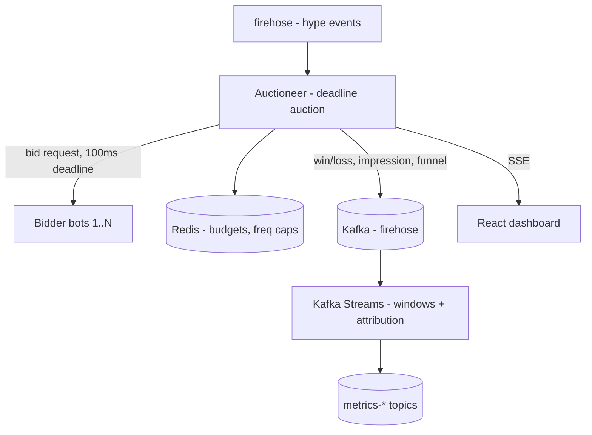

# HypeExchange

A real-time meme / hype bidding pit — a live exchange where bots bid on trending
memes in **sealed-bid auctions** that must resolve within a hard deadline (100 ms).
Mechanically it is a **real-time bidding (RTB) ad exchange**: a bid request fans out
to bidders, each returns a bid before a deadline, an auction clears, and a firehose
of events flows into windowed streaming analytics powering a live dashboard.

This repository implements the project specified in
[`P3-HypeExchange.md`](P3-HypeExchange.md).

## What it demonstrates

- **Deadline-bounded fan-out/fan-in** — call N bidders in parallel, collect
  responses, hard-cut at the timeout, drop stragglers.
- **Auction mechanics** — first-price and second-price (Vickrey) clearing.
- **Budget pacing & frequency capping** with atomic Redis operations.
- **Streaming analytics** — windowed aggregation over the event firehose with
  event-time **watermarks** for out-of-order / late events, plus correct
  impression→click attribution.
- **Latency engineering** — parallelized calls, per-call timeouts, an aggregate
  deadline, and a tuned connection pool to keep p99 under the deadline.

## Architecture



## Repository layout

```
common/        Shared model records + Kafka topic names
auctioneer/    Spring Boot (WebFlux): fan-out, deadline, clearing, budgets, SSE, Kafka producer
streams/       Kafka Streams topology (event-time windows, watermarks, attribution)
bots/          Python bidder bots (FastAPI)
gen/           Python traffic generator (firehose)
dashboard/     React (Vite) live dashboard
load/          k6 load test
docker-compose.yml   Kafka (KRaft) + Redis
```

## Prerequisites

- JDK 21
- Docker + Docker Compose (for Kafka + Redis)
- Node 18+ (dashboard)
- Python 3.10+ (bots + generator)
- Optional: [k6](https://k6.io/) for load testing

The Gradle wrapper (`./gradlew`) is included, so Gradle itself does not need to be
installed.

## How to run

```bash
# 1. Infrastructure: Kafka + Redis (also pre-creates the topics)
docker compose up -d

# 2. Auctioneer (fan-out + deadline + clearing) and the streaming analytics app
./gradlew :auctioneer:bootRun          # http://localhost:8080
./gradlew :streams:run                 # in another terminal

# 3. Bidder bots (listen on 9101..9108)
pip install -r bots/requirements.txt
python bots/run_bidders.py 8

# 4. Traffic generator (opens auctions)
python gen/firehose.py --rate 200 --duration 60

# 5. Live dashboard
npm --prefix dashboard install
npm --prefix dashboard run dev         # http://localhost:5173

# 6. Load test
k6 run load/auctions.js
```

### Running without Kafka / Redis (quick demo)

The auctioneer can run standalone (no broker, no budgets) for a quick look:

```bash
./gradlew :auctioneer:bootRun --args='--hype.kafka.enabled=false --hype.auction.enforce-budgets=false'
python bots/run_bidders.py 6
python gen/firehose.py --rate 150 --duration 10
curl -N http://localhost:8080/stream/metrics    # live SSE metrics
```

## HTTP API

- `POST /auctions` — body `{ "memeId", "category", "floorPrice", "ts?" }`; runs one
  auction and returns the `AuctionResult`.
- `GET /stream/metrics` — SSE stream of aggregated metrics snapshots (dashboard).
- `GET /stream/auctions` — SSE stream of raw auction results.
- `GET /actuator/health`, `GET /actuator/prometheus` — ops endpoints.

## How the deadline is enforced

The auctioneer ([`WebClientBidderGateway`](auctioneer/src/main/java/com/hypeexchange/auctioneer/bidder/WebClientBidderGateway.java))
calls every bidder in parallel with a non-blocking `WebClient`. Each call is wrapped
so any error or slowness collapses to `Mono.empty()`. The merged stream is then cut
with a single aggregate `Flux.take(Duration)`:

```
Flux.merge(perBidderCalls)   // each: .timeout(...).onErrorResume(empty)
    .take(deadline)          // completes at the deadline, cancels in-flight calls
    .collectList();
```

A slow bidder can therefore **never stall the auction** — at the deadline the
subscription is cancelled and whatever arrived is cleared. This is validated by
[`WebClientBidderGatewayDeadlineTest`](auctioneer/src/test/java/com/hypeexchange/auctioneer/bidder/WebClientBidderGatewayDeadlineTest.java),
which starts a slow bidder and asserts it is dropped while the auction returns on time.

## Budget races and frequency caps

Two simultaneous wins for the same bidder could overspend with a read-then-write
check. [`RedisBudgetService`](auctioneer/src/main/java/com/hypeexchange/auctioneer/budget/RedisBudgetService.java)
runs the check-decrement-cap step inside a **single Lua script** so it is atomic: a
`DECRBY` that goes negative is immediately refunded and the win rejected; the per-meme
frequency counter uses a TTL key. When the top bidder is rejected, the auctioneer
falls through to the next-best candidate (keeping correct second-price semantics).
Concurrency is proven in
[`RedisBudgetServiceTest`](auctioneer/src/test/java/com/hypeexchange/auctioneer/budget/RedisBudgetServiceTest.java)
against an embedded Redis (no Docker needed).

## Event-time, watermarks, and attribution

Clicks/invests/conversions arrive after impressions, often seconds late and out of
order (simulated by
[`FunnelSimulator`](auctioneer/src/main/java/com/hypeexchange/auctioneer/events/FunnelSimulator.java)).
The streaming app ([`AnalyticsTopology`](streams/src/main/java/com/hypeexchange/streams/AnalyticsTopology.java)):

- uses an [`EventTimeExtractor`](streams/src/main/java/com/hypeexchange/streams/serde/EventTimeExtractor.java)
  so all windows are **event-time** based;
- attaches a **grace period** to each tumbling window, so late events (within grace)
  are folded into the window they belong to and updated aggregates are re-emitted;
- joins each click to its impression by `requestId` within an event-time attribution
  window, then **re-stamps the attributed click to the impression's event-time** so
  it is counted in the impression's window — *not* the (later) window it arrived in.
  This is the crux of correct attribution.

Outputs: `metrics-meme` (auctions, fills, fill rate, spend, eCPM), `metrics-bidder`
(wins, spend, eCPM), `metrics-attribution` (impressions, attributed clicks, CTR), and
`attributed-clicks` (each impression↔click pair). Correctness is verified by
deterministic replay (including out-of-order clicks) in
[`AnalyticsTopologyTest`](streams/src/test/java/com/hypeexchange/streams/AnalyticsTopologyTest.java).

## Testing

```bash
./gradlew test
```

- Auction clearing: first/second price, ties, floors, all-timeout, budget fall-through.
- Deadline: slow bidder excluded, auction returns on time, no thread leak.
- Budget / frequency cap concurrency: no overspend, caps hold (embedded Redis).
- Streaming: window aggregates + attribution match hand-computed results, including
  out-of-order events (`TopologyTestDriver`, no broker required).

## Benchmarking

`load/auctions.js` drives auctions through the auctioneer at a target rate and asserts
the deadline holds under load:

```bash
k6 run -e RATE=5000 -e DURATION=60s load/auctions.js
```

Thresholds: `http_req_duration p(99) < 100 ms`, `p(95) < 90 ms`, and a stable fill
rate. Reported metrics include sustained auctions/sec and p99 decision latency.

## Configuration (auctioneer)

Key properties (see [`application.yml`](auctioneer/src/main/resources/application.yml)):

| Property | Default | Meaning |
| --- | --- | --- |
| `hype.auction.deadline-ms` | 100 | Hard auction deadline |
| `hype.auction.type` | `SECOND_PRICE` | `FIRST_PRICE` or `SECOND_PRICE` |
| `hype.auction.bidders` | 9101..9108 | Bidder base URLs |
| `hype.auction.enforce-budgets` | true | Toggle Redis budgets / freq caps |
| `hype.auction.freq-cap` | 5 | Max wins per bidder per meme per window |
| `hype.kafka.enabled` | true | Toggle the Kafka firehose |
